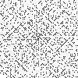
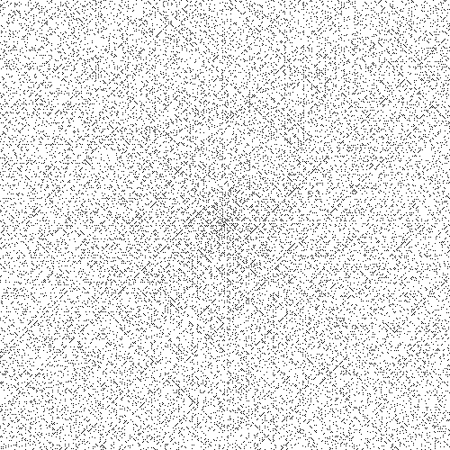

# Ulam-spiral
This Python program generates an Ulam's Spiral as a png image file. The program uses Cython to find prime numbers using the sieve of Eratosthenes algorithm. Then, the program creates a png image and traverses it in a spiral pattern. Prime numbers are marked as black pixels.

The libraries used are Image from PIL, Cython, and time. Upon running the program, the user is prompted for the value of n (the dimension of the square that will be the spiral). Then, the program begins calculations. Once finished, the program tells the user how long it took to compute and that it was successful. The program creates a file named ulam.png.

## Usage
To run the program, simply navigate to the directory where the program is saved and type the following command in your terminal:
```
python main.py
```
You will then be prompted to enter the value of n. Once you have entered your value, the program will begin calculations. After completing, the program will tell you how long it took to compute and that it was successful. The generated image file will be saved in the same directory as the program.

## Samples
- 100 x 100 spiral



- 500 x 500 spiral



- more in [samples folder](samples/)
## Requirements
The following libraries are required to run this program:
- PIL
- Cython

## Acknowledgements
This program was inspired by the mathematical work of Stanislaw Ulam, who discovered the spiral pattern of prime numbers in 1963. Special thanks to him for his groundbreaking research.
https://en.wikipedia.org/wiki/Ulam_spiral

## License 
This program is licensed under the MIT License.
